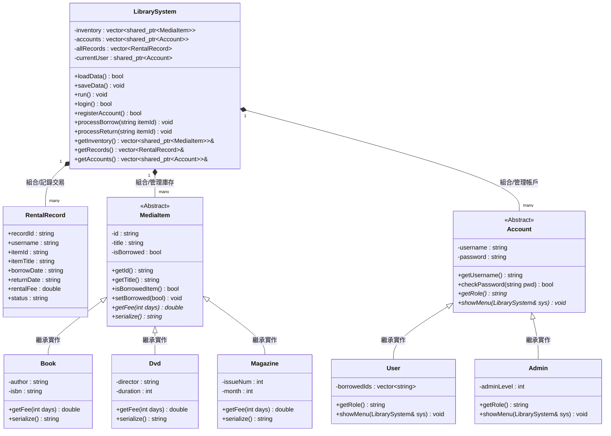

## Context

本系統為「智慧型圖書/影音多媒體租借管理系統」，主要用於展現 C++ 現代物件導向開發能力。為確保軟體的可維護性、低耦合性，類別設計將嚴格遵循 H/CPP 分離原則。為達成跨平台且便捷的編譯，專案將整合 CMake 作為建置工具，並透過檔案 I/O 進行歷史紀錄與庫存狀態的持久化。

## Goals / Non-Goals

**Goals:**
- **模組化物理結構**：每個類別（MediaItem, Book, Dvd, Magazine, Account, User, Admin, LibrarySystem）皆有專屬的標頭檔與實作檔，並依模組分類於 `media/`、`accounts/` 中。
- **雙角色選單分流**：實作登入驗證，並藉由虛擬多型函數，根據角色（User 或 Admin）渲染完全不同的 CLI 功能面板。
- **租借管理與持久化**：以結構體與 STL 管理租借交易歷史紀錄，並於借還、註冊、管理等狀態改變時，即時寫入對應文字檔案。
- **CMake 資源自動配置**：在編譯專案時自動將測試資料目錄 `data/` 複製到輸出執行檔所在目錄，確保相對路徑正常運作。

**Non-Goals:**
- **圖形化使用者介面 (GUI)**：本專案僅提供命令列 (CLI) 介面，不提供 GUI。
- **外部資料庫整合**：不使用 SQLite 或 MySQL，完全以 C++ 檔案 I/O（`std::ifstream`, `std::ofstream`）存取檔案作為資料持久化手段。
- **網路同步功能**：此系統為單機版應用，不涉及 Client-Server 架構或網路 API 傳輸。

## Decisions

### 1. 多型檔案序列化與工廠模式 (Factory Pattern)
- **選擇技術**：基底類別 `MediaItem` 提供虛擬函數 `serialize() const = 0`，衍生類別自行決定序列化輸出的格式。載入檔案時，採用簡單的物件工廠模式（解析標記為 BOOK/DVD/MAGAZINE），建立對應實體。
- **替代方案**：使用單一的大型類別並以 `enum` 區分，但這違反了物件導向的開放封閉原則（OCP），當未來新增新媒體類型（如 EBook）時會需要修改核心程式碼。

### 2. 智慧指標與記憶體管理 (Smart Pointers)
- **選擇技術**：全部使用 `std::shared_ptr` 與 `std::unique_ptr` 管理館藏與帳戶物件生命週期（如 `std::vector<std::shared_ptr<MediaItem>>`）。
- **替代方案**：使用傳統的 raw 指標並手動 `delete`，但這極易導致記憶體洩漏（Memory Leak），特別是發生異常或多型物件轉換時。

### 3. 以 CSV 格式文字檔作為輕量資料庫 (CSV-like Text Files)
- **選擇技術**：資料庫以逗號分隔（CSV 格式）文字檔保存於 `data/` 資料夾下，並以 `std::stringstream` 配合 `getline` 進行解析。
- **替代方案**：二進位二元檔案，但純文字 CSV 格式更具備良好的可讀性，方便開發者直接開啟檢查與測試。

## Risks / Trade-offs

- **[Risk] 相對路徑讀檔失敗**
  - **Trade-off**：使用者若從不同工作目錄啟動編譯出的二進位檔，相對路徑 `./data/` 可能無法存取。
  - **Mitigation**：我們在 `CMakeLists.txt` 中配置 `add_custom_target`，於建置期自動將 `data/` 資料夾拷貝至編譯輸出的 Binary 目錄下，確保開發與執行時路徑一致。
- **[Risk] 文字檔同步寫入延遲與崩潰損壞**
  - **Trade-off**：每次狀態改變都進行檔案全寫入會帶來微量 I/O 開銷。
  - **Mitigation**：由於本系統屬於單機小規模系統，寫入開銷可忽略不計；同時能保證斷電或閃退時，硬碟中保存的永遠是最新且完整一致的交易與庫存紀錄。

## Class Architecture (類別架構圖)

以下展示系統之 UML 類別關聯圖，呈現核心控制器 `LibrarySystem`、多型多媒體館藏體系、多型帳戶系統以及租借交易紀錄之間的互動結構：

---

## Class Methods Specification (類別方法說明文件)

以下為本專案中所有類別之屬性與成員函數之詳細設計規格：

### 1. 核心控制器：`LibrarySystem`
管理系統的整體狀態，包含所有帳戶、多媒體館藏與租借日誌，並處理 CLI 主選單與持久化儲存。
*   **成員變數**：
    *   `inventory`: `std::vector<std::shared_ptr<MediaItem>>` - 全館多型館藏容器。
    *   `accounts`: `std::vector<std::shared_ptr<Account>>` - 全系統多型帳戶容器。
    *   `allRecords`: `std::vector<RentalRecord>` - 全系統租借交易日誌容器。
    *   `currentUser`: `std::shared_ptr<Account>` - 當前已登入的使用者指標，未登入時為 `nullptr`。
*   **公有方法 (Public Methods)**：
    *   `loadData() -> bool`
        *   *功能*：從 `data/` 中的三個文字檔還原所有狀態。
        *   *回傳*：讀取成功回傳 `true`，失敗回傳 `false`。
    *   `saveData() -> void`
        *   *功能*：遍歷容器，將最新狀態多型序列化寫入硬碟中。
    *   `run() -> void`
        *   *功能*：啟動 CLI 主選單的無窮迴圈，處理登入前選單與登入後選單的分流。
    *   `login() -> bool`
        *   *功能*：引導使用者輸入帳號密碼，驗證成功後設置 `currentUser`。
    *   `registerAccount() -> bool`
        *   *功能*：註冊新使用者，檢查帳號是否重複，寫入 `accounts` 容器。
    *   `processBorrow(string itemId) -> void`
        *   *功能*：執行租借。變更館藏狀態、建立 `RentalRecord`、儲存檔案並更新畫面。
    *   `processReturn(string itemId) -> void`
        *   *功能*：執行歸還。計算借閱天數與費用、更新 `RentalRecord`、歸還庫存並儲存。

---

### 2. 租借紀錄：`RentalRecord`
儲存單次租借合約狀態的資料結構。
*   **成員屬性 (Public Attributes)**：
    *   `recordId`: `string` - 交易編號（格式為 `REC_XXXXX`）。
    *   `username`: `string` - 借閱人的使用者帳號。
    *   `itemId`: `string` - 所借閱的館藏 ID。
    *   `itemTitle`: `string` - 館藏品名稱。
    *   `borrowDate`: `string` - 借閱日期（YYYY-MM-DD）。
    *   `returnDate`: `string` - 歸還日期（YYYY-MM-DD，借出中為 `Pending`）。
    *   `rentalFee`: `double` - 累積租金（已歸還時計算）。
    *   `status`: `string` - 目前租借狀態 (`"BORROWED"`, `"RETURNED"`, `"OVERDUE"`).

---

### 3. 多媒體館藏繼承體系 (Media Module)

#### 3.1 抽象基底類別：`MediaItem`
所有館藏物件的基底，定義通用資料與多型介面。
*   **成員變數**：
    *   `id`: `string` - 唯一館藏識別碼（如 `B001`, `D002`）。
    *   `title`: `string` - 館藏標題名稱。
    *   `isBorrowed`: `bool` - 借閱狀態（`true` 表示已被借走，`false` 在庫）。
*   **虛擬方法 (Virtual Methods)**：
    *   `virtual getFee(int days) const -> double = 0` (純虛擬函數)
        *   *功能*：依據不同衍生多媒體類型（圖書、影音、期刊）之費率算法，計算借用指定天數的租金。
    *   `virtual serialize() const -> string = 0` (純虛擬函數)
        *   *功能*：將自己轉換為符合 CSV 標準的單行字串，以利檔案寫入。
*   **通用方法 (Public Methods)**：
    *   `getId() const -> string`、`getTitle() const -> string`、`isBorrowedItem() const -> bool`、`setBorrowed(bool) -> void`。

#### 3.2 衍生類別：`Book`
*   **額外成員**：`author` (string - 作者)、`isbn` (string - 國際標準書號)。
*   **覆寫方法**：
    *   `getFee(int days) const -> double override`：基本費用每日 10 元，若超過 7 天，超期每日以 20 元加乘滯納。
    *   `serialize() const -> string override`：輸出格式 `"BOOK,id,title,isBorrowed,author,isbn"`。

#### 3.3 衍生類別：`Dvd`
*   **額外成員**：`director` (string - 導演)、`duration` (int - 片長分鐘)。
*   **覆寫方法**：
    *   `getFee(int days) const -> double override`：基本費用每日 20 元，無寬限期。
    *   `serialize() const -> string override`：輸出格式 `"DVD,id,title,isBorrowed,director,duration"`。

#### 3.4 衍生類別：`Magazine`
*   **額外成員**：`issueNum` (int - 期號)、`month` (int - 出版月份)。
*   **覆寫方法**：
    *   `getFee(int days) const -> double override`：基本費用每日 5 元，若超過 3 天，超期每日以 10 元加乘滯納。
    *   `serialize() const -> string override`：輸出格式 `"MAGAZINE,id,title,isBorrowed,issueNum,month"`。

---

### 4. 帳戶權限繼承體系 (Account Module)

#### 4.1 抽象基底類別：`Account`
管理使用者基本憑證與 CLI 分流展示。
*   **成員變數**：
    *   `username`: `string` - 使用者帳號。
    *   `password`: `string` - 密碼（純文字儲存）。
*   **虛擬方法 (Virtual Methods)**：
    *   `virtual getRole() const -> string = 0` (純虛擬函數)
        *   *功能*：回傳 `"USER"` 或 `"ADMIN"`。
    *   `virtual showMenu(LibrarySystem& sys) -> void = 0` (純虛擬函數)
        *   *功能*：利用傳入的控制器參照 `sys`，渲染並處理不同角色的 CLI 操作主選單。

#### 4.2 衍生類別：`User` (一般讀者)
*   **成員變數**：`borrowedIds` (`vector<string>`) - 儲存當前手頭借用中館藏的 ID。
*   **覆寫方法**：
    *   `getRole() const -> string override`：回傳 `"USER"`。
    *   `showMenu(LibrarySystem& sys) -> void override`：顯示一般使用者的功能介面（瀏覽、搜尋、借閱、歸還、個人紀錄與登出）。

#### 4.3 衍生類別：`Admin` (圖書管理員)
*   **成員變數**：`adminLevel` (`int`) - 管理員權限層級。
*   **覆寫方法**：
    *   `getRole() const -> string override`：回傳 `"ADMIN"`。
    *   `showMenu(LibrarySystem& sys) -> void override`：顯示管理員專屬的管理選單（新增館藏、下架館藏、查看所有用戶狀態、審查全系統日誌與登出）。

